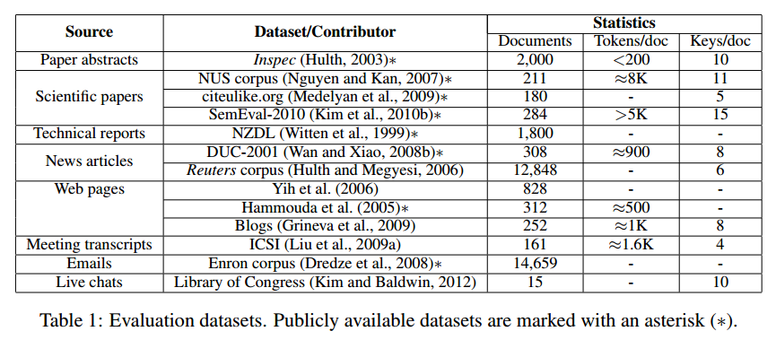
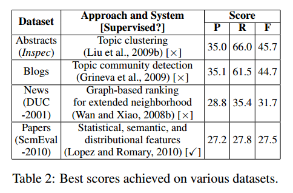

### Automatic Keyphrase Extraction: A Survey of the State of the Art
##### [2014][ACL]Kazi Saidul Hasan
There are at least four corpus-related factors that affect the difficulty of keyphrase extraction.
  1. Length. Many candidates.
  2. Structural consistency. For scientific tasks, more likely to appear in abstract and introduction.
  3. Topic change.
  4. Topic correlation. Key phrases often are topic-related.

A keyphrase extraction system typically operates in two steps: (1) extracting a list of words/phrases that serve as candidate keyphrases using some heuristics (Section 3.1); and (2) determining which of these candidate keyphrases are correct keyphrases using supervised (Section 3.2) or unsupervised (Section 3.3) approaches.

In 3.3.4 a method basing on Language Modeling is really interesting. With two pre-built corpus(foreground corpus, which captures information in current text and a background corpus captures general knowledge), the model tried to find phrases have both phraseness and informativeness.

### An Empirical Exploration of Recurrent Network Architectures
##### Jozefowicz, et al. (2015)
Jozefowicz, et al. (2015) tested more than ten thousand RNN architectures, finding some that worked better than LSTMs on certain tasks.
